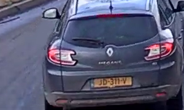

# OpenCV_test1
Here I am trying to process online video from youtube using OpenCV in order to grab car's number plates, recognize them using pytesseract and search in offline RDW database for car's details. Works awfull :). Success rate during recognition process is only about 15%, due to low video quality and also postprocessing need to be added (try adding templates for license plate to swap digits and similar characters could improve the situation). 

Collected a bunch of license plate images, splited them into characters, labeled and built neural network to recognize them.
Example :

